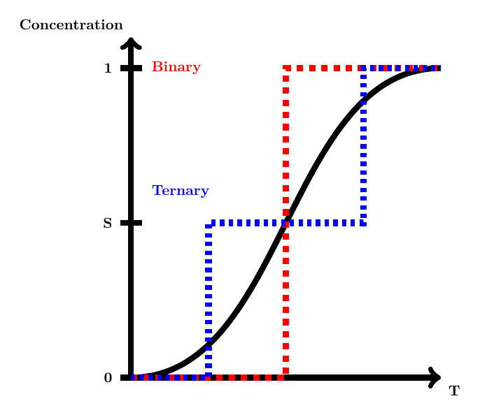
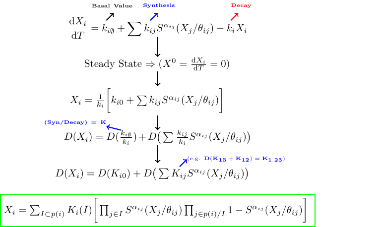

# Exhaustive Attractor detection in Logical Multivalued Regulatory Networks

The [Cpp](Cpp) class computes the node and cyclic attractors in a multivalued regulatory graph exhaustively under synchronous and asynchronous updates. The [Python](Python) class does simulate a regulatory graph but simply aims to parameterize its logical values based on an input cyclic trajectory. Note that both of these modules are exhaustive and pretty simple implementations. BioModelChecker translates the parameterization problem to a CS problem which is solved far more efficiently and can handle missing values in the trajectories.
The [Cpp](Cpp) and [Python](Python) classes simulate the time evolution of the network and form a so called State Transition Graph (STG) that could be traveressed to detect cyclic and node attractors.
An attractor is a set of state(s) where once the system enters them, stays there indefinitely. 
The attractors are closely related to [Strongly Connected Components (SCC)](https://en.wikipedia.org/wiki/Strongly_connected_component) in a graph but without any outdegrees. In 1972, Tarjan proposed an algorithm that only requires a single depth-first search to compute the SCCs in a graph. The method implemented here is a modified Tarjan's algorithm to detect cyclic and node attractors in a graph. The method is practical up to a STG of size 220.

## Logical Regulatory Graph 

A logical regulatory graph is defined as a directed and weighted graph where each edge denotes an interaction (inhibition or promotion) and its corresponding weight indicates the state above which that action becomes active. These can also be denoted as matrix as shown below;

## Discrete Approximation

The multivalued networks approximate the continous concentration level of biological entities in a discrete manner and therefore reduce the simulation search space to a discrete space.

## Transition Function

The equations below indicate how a typical differential equation that describes the concentration level of an entity can be approximated by discrete values. The **S** function below is simply a threshold function that checks whether the state level of an entity is above or equal to its outgoing edge.

You might ask how this equation might work in practice (the K value defined in the equation above). The image below shows interactively how the image an entity is defined given its regulators (computer science guys call regulators fan-inns). The index of a K value is determined by accounting for active regulators.

## Time Updates

The STG of a regulatory graph might be simulated by iteratively computing its image. Once the image (tendency) of the network at the next step is computed one has to decide about the order of update (e.g. out of the 4 entities for instance in this network which entity gets updated first or do they get updated simulatnously). The figure below illustrates two special type of time updates called [priority with memory](https://bmcsystbiol.biomedcentral.com/articles/10.1186/s12918-018-0599-1) (similar to asynchronous) where only a single entity gets updated at a time and synchronous where all the entites can get updated simultanously. The green edges indicate an attractor. Depending on the time update chosen the shape of the STG and **cylic** attractors would be different.

