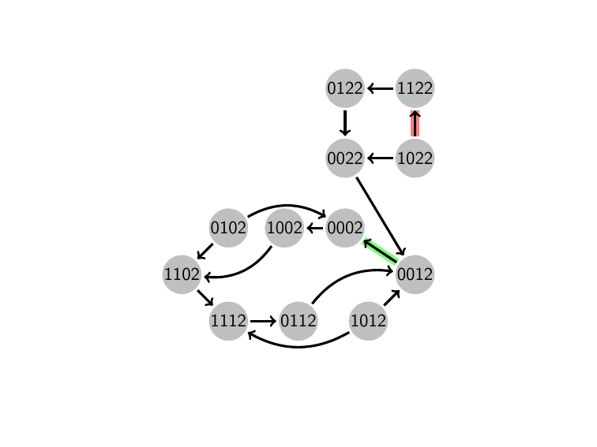

# Exhaustive Attractor detection in Logical Multivalued Regulatory Networks

The class computes the node and cyclic attractors in a multivalued regulatory graph exhaustively.
It simulates the time evolution of the network and forms a so called State Transition Graph (STG) that could be traveresed to detect cyclic and node attractors.
An attractor is a set of state(s) where once the system enters them, stays there indefinitely. 
The attractors are closely related to [Strongly Connected Components (SCC)] (https://en.wikipedia.org/wiki/Strongly_connected_component) in a graph but without any outdegrees. In 1972, Tarjan proposed an algorithm that only requires a single depth-first search to compute the SCCs in a graph. The method implemented here is a modified Tarjan's algorithm to detect cyclic and node attractors in a graph.

