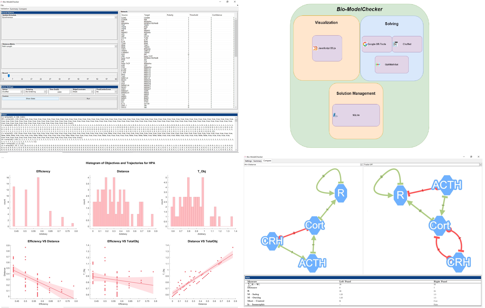

# BioModelChecker
Biological Model Checker (Bio-MC) is a bounded model checker for parameterization of generalized regulatory networks (Thomas Networks) created by Hooman Sedghamiz at [Center for Clinical Systems Biology (CCSB)](https://www.rochesterregional.org/research/clinical-systems-biology/). For a brief introduction to Thomas Networks see the **Attractor Detection** directory.

Bio-ModelChecker treats the model parametrization problem as a multi-objective optimization inspired from Control Theory and biology. It employs the power of state of the art Constraint Programming in order to efficiently parameterize a regulatory network. 
Bio-ModelChecker is copyrighted 2018 by Center for Clinical Systems Biology. All rights reserved.

Bio-ModelChecker is available for research and evaluation purposes only. It can not be used in a commercial environment, particularly as part of a commercial product, without written permission. Bio-ModelChecker is provided as is, without any warranty.



## Abstract 
The in Silico study and reverse engineering of regulatory networks has gained in recognition as an insightful tool for the qualitative study of biological mechanisms that underlie a broad range of  complex illness. In the creation of reliable network models, the integration of prior mechanistic knowledge with experimentally observed behavior is hampered by the disparate nature and  widespread sparsity of such measurements. The former challenges conventional regression-based parameter fitting while the latter leads to large sets of highly variable but equally data compliant network models. 
BioModelChecker (BioMC) proposes a Constraint Satisfaction (CS) based bounded model checking framework for parameter set identification that readily accommodates partial records and the exponential complexity of this problem. BioMC introduces specific criteria to describe the biological plausibility of competing multi-valued regulatory networks that satisfy all the constraints and formulate model identification as a multi-objective optimization problem. Optimization is directed at  maximizing structural parsimony by mitigating control action selectivity while also favoring increased state transition efficiency and robustness of the network’s dynamic response. 

## Getting Started
### 1 - Operating System :
The current version of BioMC has been only tested on 64bit Windows Operating System. To be used on Unix and MACos one might want to rely on [Oracle Virtual Machine](https://www.virtualbox.org/) for now.

### 2 - Download the BioMC-Installer.exe :
Download the BioMC-Installer.exe from the "release" tab on top of this page and the installer would guide you with the next steps

### 3 - Replace 'classpath.txt' and 'jxbrowser':
Please see the [```BioMC-usermanual.pdf```](BioMC-usermanual.pdf) for a detailed instructions how to replace ```classpath.txt``` and ```jxbrowser```. BioMC already comes with several benchmarks in  ```.json ``` format that could be used to get familiar with the tool.

## Related Publications:
[1] H. Sedghamiz, M. Morris, TJK. Craddock, D. Whitley, G. Broderick. "Bio-ModelChecker: Using Bounded Constraint Satisfaction to Seamlessly Integrate Observed Behavior with Prior Knowledge of Biological Networks" (Preprint-2019).

[2] H. Sedghamiz, M. Morris, TJK. Craddock, D. Whitley, G. Broderick. "Computation of Robust Minimal Intervention Sets in Multi-valued Biological Regulatory Networks" [In Frontiers in Physiology, section Systems Biology, 2019](https://www.researchgate.net/publication/331328126_Computation_of_Robust_Minimal_Intervention_Sets_in_Multi-valued_Biological_Regulatory_Networks).

[3] H. Sedghamiz, W. Chen, M. Rice, D. Whitley, G. Broderick. "Selecting Optimal Models Based on Efficiency and Robustness in Multi-valued Biological Networks". [In 2017 IEEE 17th International Conference on Bioinformatics and Bioengineering (BIBE)](https://ieeexplore.ieee.org/document/8251289/).

[4] H. Sedghamiz, M. Morris, TJK. Craddock, D. Whitley, G. Broderick. "High-fidelity discrete modeling of the HPA axis: a study of regulatory plasticity in biology". [In BMC Systems Biology 1-12-76, 2018](https://bmcsystbiol.biomedcentral.com/articles/10.1186/s12918-018-0599-1).

[5] How text mining is changing the way we tackle chronic disease. [Elsevier Connect, 2017](https://www.elsevier.com/connect/how-text-mining-is-changing-the-way-we-tackle-chronic-disease).

## Acknowledgement

### Solvers 
The BioMC software relies on the amazing technologies and efforts developed in Constraint Satisfaction and Operation Research groups such as:

#### [D61 Decision Sciences - MiniZinc](https://github.com/MiniZinc) 

#### [D61 Decision Sciences - Chuffed Solver](https://github.com/chuffed/chuffed)

#### [Google's Operations Research tools - OR-tools Solver](https://github.com/google/or-tools)

#### [Fondazione Bruno Kessler - OptiMathSat SMT Solver](http://optimathsat.disi.unitn.it/)

### Visualization
For visualization, BioMC relies on the following nice libraries:

#### [Mike Bostock - d3](https://github.com/d3/d3)

#### [Pier Morel - Gramm](https://github.com/piermorel/gramm)

#### [CytoScape - Cytoscape.js](https://github.com/cytoscape)


